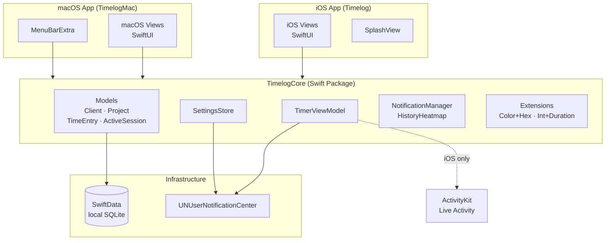

# Architecture

## Monorepo Structure

The repository contains two native apps and a shared Swift package.

```
TimeLog/
├── TimeLog.xcworkspace          ← Xcode entry point
├── Timelog.xcodeproj            ← iOS app
├── TimelogMac.xcodeproj         ← macOS app
├── TimelogCore/                 ← shared Swift Package
│   └── Sources/
│       └── TimelogCore/         ← models, VM, stores, helpers
├── Timelog/                     ← iOS Views
└── TimelogMac/                  ← macOS Views
```

## Application Layers


```mermaid
graph TD
    subgraph iOS["iOS App (Timelog)"]
        iViews["iOS Views\nSwiftUI"]
        iSplash["SplashView"]
    end

    subgraph macOS["macOS App (TimelogMac)"]
        mViews["macOS Views\nSwiftUI"]
        mMenu["MenuBarExtra"]
    end

    subgraph Core["TimelogCore (Swift Package)"]
        Models["Models\nClient · Project\nTimeEntry · ActiveSession"]
        VM["TimerViewModel"]
        Store["SettingsStore"]
        Helpers["NotificationManager\nHistoryHeatmap"]
        Ext["Extensions\nColor+Hex · Int+Duration"]
    end

    subgraph Infra["Infrastructure"]
        SD[("SwiftData\nlocal SQLite")]
        UNS["UNUserNotificationCenter"]
    end

    iViews --> Core
    mViews --> Core
    mMenu --> Core

    VM --> UNS
    VM -.->|"iOS only"| LiveActivity["ActivityKit\nLive Activity"]
    Store --> UNS
    Models --> SD
```

## Architectural Rules

| Rule | Rationale |
|------|-----------|
| Business logic only in `TimelogCore` | Apps contain exclusively Views |
| Everything `public` in TimelogCore | Visible from both apps |
| One `ModelContainer` per app | Avoids SwiftData conflicts; on macOS it is `static let` shared between WindowGroup and MenuBarExtra |
| `#if os(iOS)` for ActivityKit and UIKit haptics | Do not use `#if targetEnvironment(macCatalyst)` — the project does not use Catalyst |
| `deletedAt: Date?` on Client, Project, TimeEntry | Soft delete: records are marked rather than removed, so history and analytics keep resolving their references. `ActiveSession` has no `deletedAt` because it is always converted to a `TimeEntry` on stop. |

## Entry Points by Platform

### iOS — `TimelogApp.swift`
```
App
 └─ ModelContainer (Client, Project, TimeEntry, ActiveSession)
     └─ ZStack
         ├─ ContentView
         │   └─ TabBar: Today · Clients · Timer · Settings
         └─ SplashView (fades after initial animation)
```

### macOS — `TimelogMacApp.swift`
```
App
 ├─ static ModelContainer (shared)
 ├─ WindowGroup "main"
 │   └─ MainMacView
 │       └─ NavigationSplitView: Today · Clients · Tracking · Settings
 ├─ MenuBarExtra
 │   └─ MenuBarView (window style)
 │       └─ MenuBarStatusLabel (shows timer if running)
 └─ Settings (⌘,)
     └─ MacSettingsView
```
