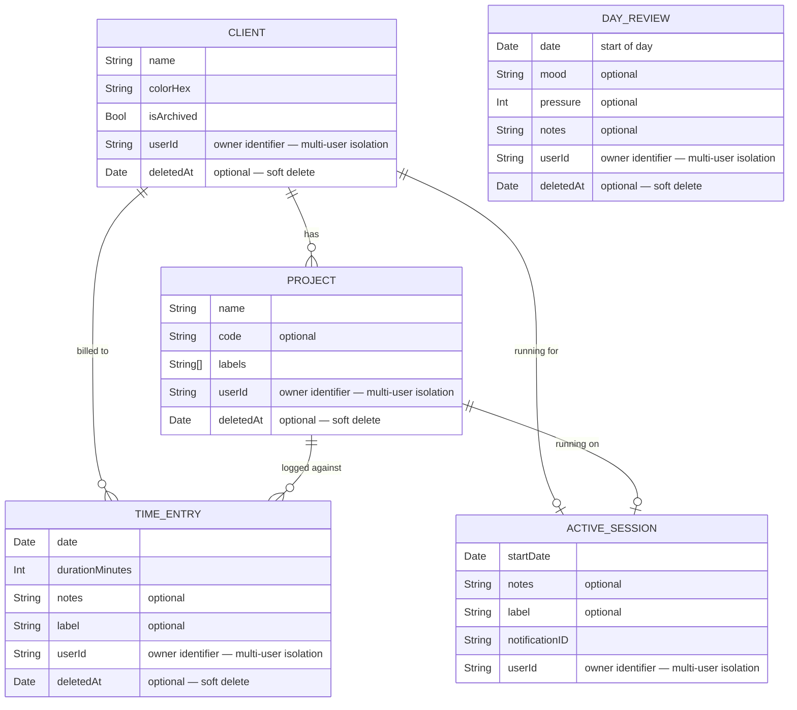
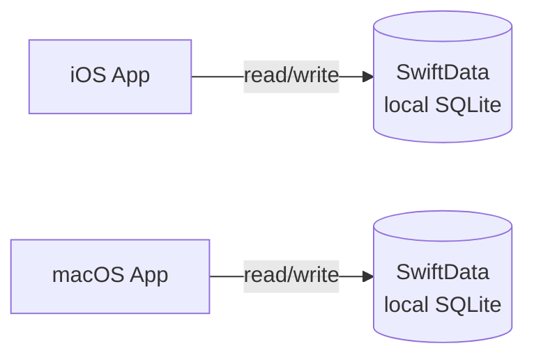

# Data Model

## Entities and relationships

```mermaid
erDiagram
    CLIENT {
        String  name
        String  colorHex
        Bool    isArchived
        String  userId      "owner identifier — multi-user isolation"
        Date    deletedAt   "optional — soft delete"
    }
    PROJECT {
        String     name
        String     code        "optional"
        String[]   labels
        String     userId      "owner identifier — multi-user isolation"
        Date       deletedAt   "optional — soft delete"
    }
    TIME_ENTRY {
        Date    date
        Int     durationMinutes
        String  notes       "optional"
        String  label       "optional"
        String  userId      "owner identifier — multi-user isolation"
        Date    deletedAt   "optional — soft delete"
    }
    ACTIVE_SESSION {
        Date    startDate
        String  notes       "optional"
        String  label       "optional"
        String  notificationID
        String  userId      "owner identifier — multi-user isolation"
    }
    DAY_REVIEW {
        Date    date        "start of day"
        String  mood        "optional"
        Int     pressure    "optional"
        String  notes       "optional"
        String  userId      "owner identifier — multi-user isolation"
        Date    deletedAt   "optional — soft delete"
    }

    CLIENT ||--o{ PROJECT       : "has"
    CLIENT ||--o{ TIME_ENTRY    : "billed to"
    CLIENT ||--o| ACTIVE_SESSION : "running for"
    PROJECT ||--o{ TIME_ENTRY   : "logged against"
    PROJECT ||--o| ACTIVE_SESSION : "running on"
```

## Entity descriptions

### `Client`
Represents a client. Holds the list of projects (cascade delete) and is referenced by TimeEntry and ActiveSession.

- `colorHex` — identifying colour in `#RRGGBB` format, exposed as `Color` via `Color+Hex`
- `userId` — nickname/identifier of the record owner, set at creation time from `SettingsStore.userId`; used to isolate data per user on a shared database. All `@Query` results are filtered to records where `userId == settings.userId`. Defaults to `""` for pre-migration records; migrated on first launch.
- `deletedAt` — logical deletion date (`nil` = active); records are marked rather than removed
- Relationship with `Project`: deleteRule `.cascade` — deleting a client removes all its projects

### `Project`
Project belonging to a client. The `code` field is optional (job number, e.g. "PRJ-001").

- `labels` — free-form string tags (`[String]`, defaults to `[]`)
- `Project` has **no** `isArchived` flag — only `Client` is archivable
- Relationship with `TimeEntry`: deleteRule `.nullify` — deleting a project does not delete entries, just unlinks them
- `userId` — same as above; identifies the owner of the record
- `deletedAt` — same as above (soft delete)

### `TimeEntry`
A logged time record. The core data structure of the app.

- `durationMinutes` — duration in whole minutes; formatted via `Int.formattedDuration` ("1h 30m")
- `notes` and `label` — optional free-form text fields
- `client` and `project` are optional — an entry can be unassigned
- `userId` — same as above; identifies the owner of the record
- `deletedAt` — same as above (soft delete)

### `ActiveSession`
An in-progress tracking session. At most one per active client/project combination. Has no `deletedAt` because it is converted into a `TimeEntry` on stop — it is never logically deleted.

- `client` and `project` optional — a session can be unassigned
- `notes` — optional notes transferred to the `TimeEntry` on stop
- `label` — optional tag transferred to the `TimeEntry` on stop
- `userId` — same as above; identifies the owner of the record
- `elapsedDisplay` — `"HH:MM:SS"` string computed at runtime from `startDate`
- `elapsedMinutes` — computed integer, used to estimate duration before stopping
- `notificationID` — ID of the UNUserNotification for the open-session reminder; cancelled on stop

### `DayReview`
A per-day review record shared by iOS and macOS. It is the long-term home for end-of-day mood, pressure, and notes. Current macOS closure notes can still be read from `TimeEntry.notes`; migration into `DayReview` is a separate follow-up.

- `date` — normalized to the start of the reviewed day
- `mood` — optional mood label
- `pressure` — optional numeric pressure value, left flexible until the UI scale is finalized
- `notes` — optional end-of-day notes
- `userId` — same as above; identifies the owner of the record
- `deletedAt` — same as above (soft delete)

### `SettingsStore.userId`
`userId` is not a SwiftData entity but a persisted setting. It is stored in `UserDefaults` under the key `"user_id"` and exposed via `SettingsStore`. On first launch, the app shows a nickname prompt that populates this value. All four models default to `userId = ""` to support pre-migration data; on first launch, existing records with an empty `userId` are migrated to the current `settings.userId`.

---

## Persistence

```mermaid
flowchart LR
    iApp["iOS App"] -->|"read/write"| SD_iOS[("SwiftData\nlocal SQLite")]
    mApp["macOS App"] -->|"read/write"| SD_MAC[("SwiftData\nlocal SQLite")]
```

All data is device-local. The two apps keep separate stores and never exchange records.
